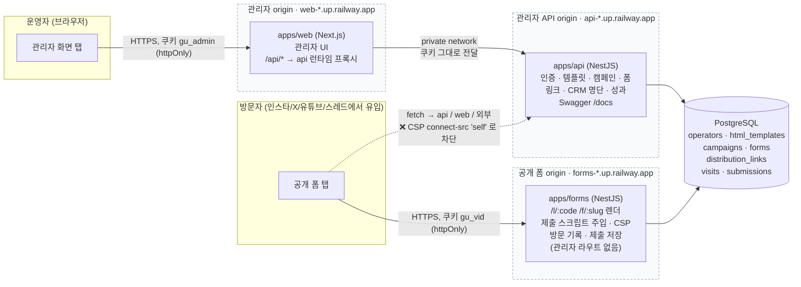
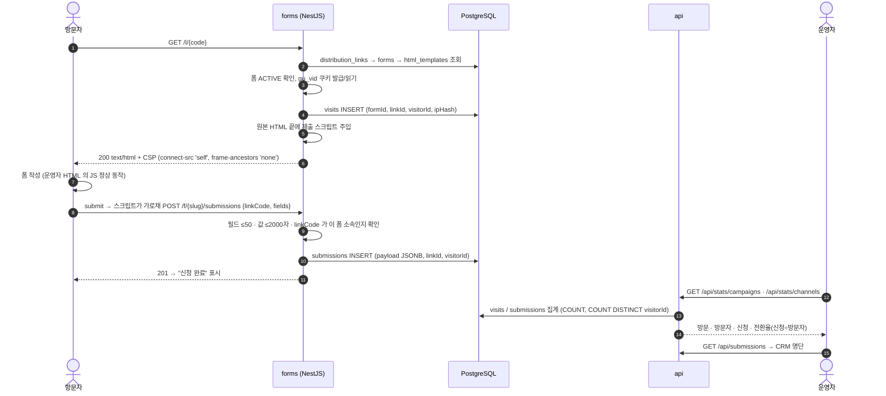

# 시스템 구성도

이미지: [구성도](diagrams/architecture.png) · [ERD](diagrams/erd.png) · [방문자 흐름](diagrams/visitor-flow.png) · [운영자 흐름](diagrams/operator-flow.png)

## 1. 서비스 구성과 origin 경계

- 세 origin 은 서로 다른 호스트. 등록 HTML 은 forms origin 에서만 실행되며 관리자 쿠키·DOM·API 에 닿을 수 없다 (ADR-0003).
- forms 프로세스에는 관리자 컨트롤러 코드 자체가 없다. 두 서버가 같은 DB 를 쓰되 forms 는 `visits` / `submissions` 쓰기와 `forms` / `distribution_links` / `html_templates` 읽기만 한다.
- 로컬(docker compose): web `localhost:3000`, api `localhost:3001`, forms `127.0.0.1:3002` — 호스트를 달리해 쿠키 분리.

## 2. 운영자 흐름

```mermaid
sequenceDiagram
  autonumber
  actor Op as 운영자
  participant Web as web (Next.js)
  participant Api as api (NestJS)
  participant DB as PostgreSQL

  Op->>Web: POST /api/auth/login (email, password)
  Web->>Api: 프록시
  Api->>DB: operators 조회, bcrypt 검증
  Api-->>Web: 200 + Set-Cookie gu_admin (JWT, httpOnly)
  Web-->>Op: 대시보드

  Op->>Web: POST /api/templates (multipart .html)
  Web->>Api: 프록시 (쿠키 포함)
  Api->>Api: .html · ≤512KB · <form> 포함 검증
  Api->>DB: html_templates INSERT (원문 그대로)

  Op->>Api: POST /api/campaigns → campaigns
  Op->>Api: POST /api/forms (campaignId, templateId, slug) → forms
  Op->>Api: POST /api/links (formId, channel) ×4
  Api->>DB: distribution_links INSERT (code 8자)
  Api-->>Op: { url: https://forms…/l/{code} }
  Op->>Op: 각 채널에 링크 게시
```

## 3. 방문자 흐름 (채널 링크 → 신청 → 성과)

## 4. 데이터 모델

ERD 와 테이블 설명은 [schema.md](schema.md) 참고.
