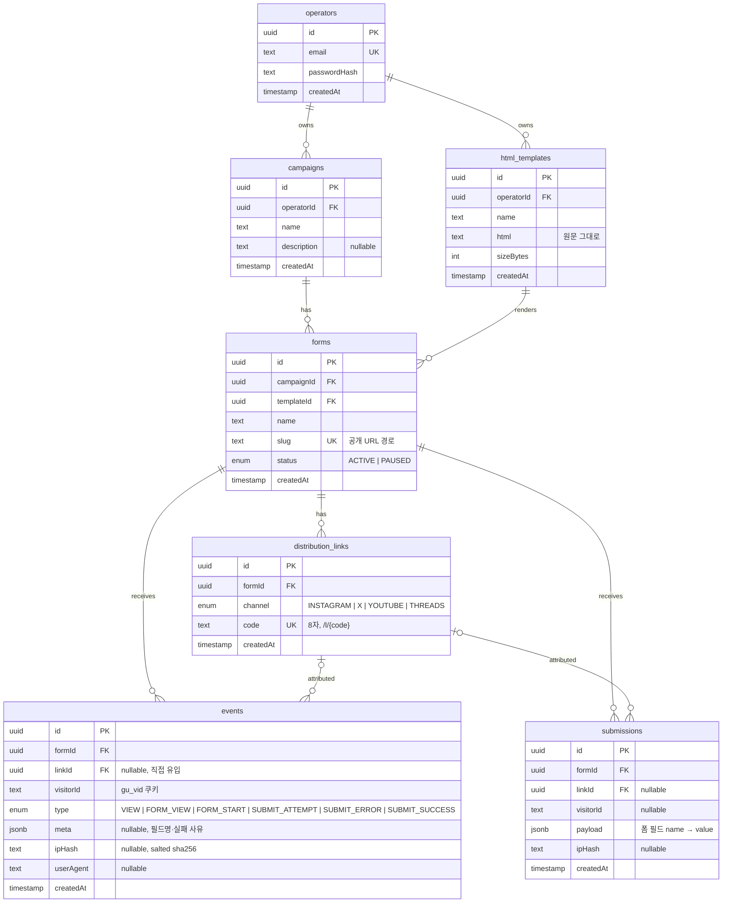

# 데이터베이스 스키마

이미지: [ERD (PNG)](diagrams/erd.png) · [SVG](diagrams/erd.svg) · 시스템 구성도는 [architecture.md](architecture.md)

PostgreSQL 16. 정의 원본은 [`packages/db/prisma/schema.prisma`](../packages/db/prisma/schema.prisma), 적용 SQL 은 [`packages/db/prisma/migrations/`](../packages/db/prisma/migrations/).

## 테이블 설명

| 테이블 | 역할 | 비고 |
|---|---|---|
| `operators` | 운영자 계정 | bcrypt 해시. 시드로 생성 |
| `html_templates` | 운영자가 등록한 단일 `.html` | 원문 보존. 폼이 참조 중이면 삭제 불가 (`Restrict`) |
| `campaigns` | 성과 집계 최상위 단위 | 삭제 시 하위 cascade |
| `forms` | 캠페인 × 템플릿 = 공개 신청 폼 | `slug` 유니크. `PAUSED` 면 공개 403 |
| `distribution_links` | 채널별 배포 링크 | `code` 유니크. 삭제 시 방문/신청은 `linkId=null` 보존 (`SetNull`) |
| `events` | 퍼널 이벤트 1건 | `type`: VIEW·FORM_VIEW·FORM_START·SUBMIT_ATTEMPT·SUBMIT_ERROR·SUBMIT_SUCCESS. `meta` JSONB(필드명·실패 사유). 단계 수 = `visitorId` distinct |
| `submissions` | 신청 1건 = CRM 명단 행 | `payload` JSONB (스키마 자유) |

## 인덱스

- `html_templates(operatorId)`, `campaigns(operatorId)`, `forms(campaignId)`, `distribution_links(formId)`
- `events(formId, type, createdAt)`, `events(formId, visitorId)`, `events(visitorId, createdAt)`, `events(linkId)` — 단계별 집계, 고유 방문자, 여정 조회
- `submissions(formId, createdAt)`, `submissions(linkId)`

## 삭제 정책

| 부모 삭제 | 자식 |
|---|---|
| operator | templates, campaigns cascade |
| campaign | forms cascade → links/events/submissions cascade |
| template | forms 있으면 **거부** |
| form | links/events/submissions cascade |
| link | events/submissions **보존**, `linkId → null` |

## 집계 정의 (ADR-0005, ADR-0007)

- 단계 수 = `count(distinct events.visitorId) where type = <단계>`. 페이지뷰 = `count(events) where type = 'VIEW'`
- 단계 전환율 = 이번 단계 ÷ 직전 단계, 전체 전환율 = SUBMIT_SUCCESS ÷ VIEW (0 → 0)
- 채널별 = `linkId` 가 있는 이벤트만 (`/f/:slug` 직접 유입 제외), 마지막 클릭 귀속
- CRM 명단 건수 = `count(submissions)` — 방문자 쿠키 없이 제출된 건은 명단에는 있고 퍼널(SUBMIT_SUCCESS)에는 없을 수 있다
